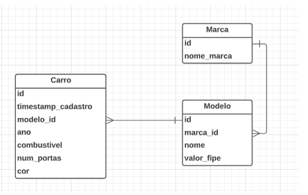
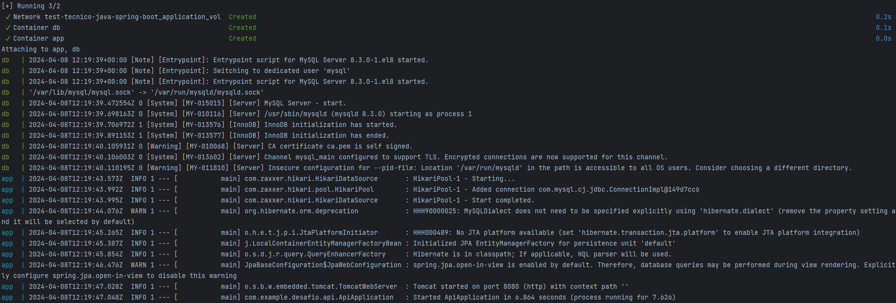

# Desafio Técnico
```diff
 Documentação
```
<details>
  <summary>Breve explicação sobre minhas decisões:</summary><br />

Arquitetura:
 
```diff
 Por se tratar de uma pequena API e um projeto pequeno, resolvi usar arquitetura de camadas
 pela velocidade de desenvolvimento e organização de fácil entendimento.
```
Cardialidade:
 
```diff
 - Um CarEntity está relacionado a um único ModelCarEntity.
 - Um ModelCarEntity pode estar relacionado a vários CarEntity.
 
 Ou seja um MODELO pode ter vários Carros.

 - Um ModelCarEntity está relacionado a uma única BrandEntity.
 - Uma BrandEntity pode estar relacionada a vários ModelCarEntity.

 Ou seja uma MARCA pode ter vários MODELOS.

 Logo, para evitar bugs e manter a integridade do banco, decidi que
 no momento em que registro um carro, automaticamente preciso também
 registrar um Modelo que por sua vez precisa de uma Marca. Não existe
 um Carro sem um modelo, como também não existe um Modelo sem uma Marca,
 não faz sentido cadastrar-los separadamente.
```
Método de resposta para o cliente:
```diff
 Optei por implementar a classe ApiResponseService, que basicamente serve para padronizar a resposta ao cliente,
 facilitando a manipulação dos dados retornados pela API, padronizando todos os EndPoints.
```


</details>


<details>
<summary>Banco de dados</summary><br>


</details>
  
## Rota de Carros

```diff
http://localhost:8080/api/car
```

POST `/register`:
<details>
  <summary>🔍 Formato/exemplo de request e resposta</summary><br />

Essa rota precisa de um @RequestBody (CarAndModelAndBrandDto) `/register` exemplo:
<br/>

```diff
Note que: Ao cadastrar um carro, automaticamente um Modelo e uma Marca também são cadastrados para manter integridade do Banco
```

```json
{
  "nameBrand": "Bugati",
  "modelName": "fusca",
  "year": 2024,
  "fuel": "Gasolina",
  "numDoors": 2,
  "color": "White",
  "priceFip": 50.000
}
```

Exemplo de resposta em caso de sucesso - 201 - CREATED:

```json
{
    "success": true,
    "message": "Carro registrado com sucesso",
    "response": null
}
```
Exemplo de resposta em caso de input de usuário inválido - 400 - BAD REQUEST:

```json
{
    "timestamp": "2024-04-07T13:32:02.004+00:00",
    "status": 400,
    "error": "Bad Request",
    "path": "/api/car/register"
}
```
Exemplo de resposta em caso de erro interno - 500 - SERVER INTERNAL ERROR:

```json
{
    "success": false,
    "message": "Erro ao registrar o carro: Mensagem de erro",
    "response": null
}
```

</details>

UPDATE `/update/{id}`:
<details>
  <summary>🔍 Formato/exemplo de request e resposta</summary><br />

Está rota recebe um @PathVariable(id) e @RequestBody(CarAndModelAndBrandDto) `/update/{id}`:

```json
{
  "year": 2023,
  "fuel": "Alcool",
  "numDoors": 2,
  "color": "Preto"
}
```

Exemplo de resposta em caso de sucesso - 200 - OK:

```json
{
    "success": true,
    "message": "Carro atualizado com sucesso",
    "response": null
}
```
Exemplo de resposta em caso de input de usuário inválido - 400 - BAD REQUEST:

```json
{
    "timestamp": "2024-04-07T14:01:06.216+00:00",
    "status": 400,
    "error": "Bad Request",
    "path": "/api/car/update/1"
}
```
Exemplo de resposta em caso de ServerInternelError - 500 - SERVER INTERNAL ERROR:

```json
{
    "success": false,
    "message": "Erro ao atualizar o carro: Mensagem de erro",
    "response": null
}
```
</details>

GET `/get-all`:
<details>
  <summary>🔍 Formato/exemplo de request e resposta</summary><br />

Exemplo de resposta:

```json
{
    "success": true,
    "message": "Carros retornados com sucesso!",
    "response": [
        {
            "id": 1,
            "year": 2024,
            "fuel": "Alcool",
            "color": "Preto",
            "numDoors": 2,
            "priceFip": 50.000,
            "modelName": "Gol",
            "modelId": 1,
            "timestampRegister": 1712424660
        },
        {
            "id": 2,
            "year": 2024,
            "fuel": "Gasolina",
            "color": "Preto",
            "numDoors": 2,
            "priceFip": 50.000,
            "modelName": "Gol",
            "modelId": 1,
            "timestampRegister": 1712424708
        },
    ]
}
```
Exemplo de resposta em caso de ServerInternelError - 500 - SERVER INTERNAL ERROR:

```json
{
    "success": false,
    "message": "Erro ao buscar os carros: Mensagem de erro",
    "response": null
}
```
</details>


DELETE `/delete/{id}`:
<details>
  <summary>🔍 Formato/exemplo de requisição e resposta</summary><br />

Está rota recebe um @PathVariable(id) `/delete/{id}`:

Exemplo de resposta em caso de sucesso - 200 - Ok:

```json
{
    "success": true,
    "message": "Carro deletado com sucesso",
    "response": null
}
```

Exemplo de resposta em caso de erro - 500 - ServerInternalError:

```json
{
    "success": false,
    "message": "Erro ao deletar o carro: Ocorreu um erro ao processar a operação com o carro.",
    "response": null
}
```
</details>


## Rota de Modelos

```diff
http://localhost:8080/api/model-car
```


UPDATE `/update/{id}`:
<details>
  <summary>🔍 Formato/exemplo de request e resposta</summary><br />

Está rota recebe um @PathVariable(id) e @RequestBody(ModelDto) `/update/{id}`:

```json
{
    "modelName": "Corsa",
    "priceFip": 15.000
}
```

Exemplo de resposta em caso de sucesso - 200 - OK:

```json
{
    "success": true,
    "message": "Modelo atualizado com sucesso",
    "response": null
}
```
Exemplo de resposta em caso de input de usuário inválido - 400 - BAD REQUEST:

```json
{
    "timestamp": "2024-04-07T14:01:06.216+00:00",
    "status": 400,
    "error": "Bad Request",
    "path": "/api/car/update/1"
}
```
Exemplo de resposta em caso de erro interno - 500 - SERVER INTERNAL ERROR:

```json
{
    "success": false,
    "message": "Erro ao atualizar o modelo: Mensagem de erro",
    "response": null
}
```
</details>

GET `/get-all`:
<details>
  <summary>🔍 Formato/exemplo de request e resposta</summary><br />

Exemplo de resposta:

```json
{
    "success": true,
    "message": "Carros retornados com sucesso!",
    "response": [
        {
            "id": 1,
            "year": 2024,
            "fuel": "Alcool",
            "color": "Preto",
            "numDoors": 2,
            "priceFip": 50.000,
            "modelName": "Gol",
            "modelId": 1,
            "timestampRegister": 1712424660
        },
        {
            "id": 2,
            "year": 2024,
            "fuel": "Gasolina",
            "color": "Preto",
            "numDoors": 2,
            "priceFip": 50.000,
            "modelName": "Gol",
            "modelId": 1,
            "timestampRegister": 1712424708
        },
    ]
}
```
Exemplo de resposta em caso de ServerInternelError - 500 - SERVER INTERNAL ERROR:

```json
{
    "success": false,
    "message": "Erro ao buscar os carros: Mensagem de erro",
    "response": null
}
```
</details>


DELETE `/delete/{id}`:
<details>
  <summary>🔍 Formato/exemplo de requisição e resposta</summary><br />

Está rota recebe um @PathVariable(id) `/delete/{id}`:

Exemplo de resposta em caso de sucesso - 200 - Ok:

```json
{
    "success": true,
    "message": "Carro deletado com sucesso",
    "response": null
}
```

Exemplo de resposta em caso de erro - 500 - ServerInternalError:

```json
{
    "success": false,
    "message": "Erro ao deletar o carro: Mensagem de erro.",
    "response": null
}
```
</details>


## Rota de Marcas

```diff
http://localhost:8080/api/brand
```

UPDATE `/update/{id}`:
<details>
  <summary>🔍 Formato/exemplo de request e resposta</summary><br />

Está rota recebe um @PathVariable(id) e @RequestBody(BrandRequestDto) `/update/{id}`:

```json
{
    "nameBrand": "Ferrari"
}
```

Exemplo de resposta em caso de sucesso - 200 - OK:

```json
{
    "success": true,
    "message": "Marca atualizada com sucesso",
    "response": null
}
```
Exemplo de resposta em caso de input de usuário inválido - 400 - BAD REQUEST:

```json
{
    "timestamp": "2024-04-07T14:01:06.216+00:00",
    "status": 400,
    "error": "Bad Request",
    "path": "/api/car/update/1"
}
```
Exemplo de resposta em caso de ServerInternelError - 500 - SERVER INTERNAL ERROR:

```json
{
    "success": false,
    "message": "Erro ao atualizar marca: Mensagem de erro",
    "response": null
}
```
</details>

GET `/get-all`:
<details>
  <summary>🔍 Formato/exemplo de request e resposta</summary><br />

Exemplo de resposta:

```json
{
    "success": true,
    "message": "Marcas encontradas com sucesso",
    "response": [
        {
            "id": 1,
            "deleted": false,
            "nameBrand": "Ferrari"
        },
        {
            "id": 2,
            "deleted": false,
            "nameBrand": "Tesla"
        },
        {
            "id": 3,
            "deleted": false,
            "nameBrand": "Mustang"
        }
    ]
}
```
Exemplo de resposta em caso de ServerInternelError - 500 - SERVER INTERNAL ERROR:

```json
{
    "success": false,
    "message": "Erro ao buscar marcas: Mensagem de erro",
    "response": null
}
```
</details>

DELETE `/delete/{id}`:
<details>
  <summary>🔍 Formato/exemplo de requisição e resposta</summary><br />

Está rota recebe um @PathVariable(id) `/delete/{id}`:

Exemplo de resposta em caso de sucesso - 200 - Ok:

```json
{
    "success": true,
    "message": "Marca deletada com sucesso",
    "response": null
}
```

Exemplo de resposta em caso de erro - 500 - ServerInternalError:

```json
{
    "success": false,
    "message": "Erro ao deletar marca: Mensagem de erro.",
    "response": null
}
```
</details>

## Link Swagger configurado pra 8080

```diff
http://localhost:8080/swagger-ui/index.html#/
```

## Docker e Docker compose

Para subir a aplicação basta rodar o seguinte comando:
```diff
docker-compose up --build
```


## Versão em Kotlin

Branch:
```
feat-versão-api-em-kotlin
```


# Tecnologias

- Java;
- Spring Boot;
- Spring Validation;
- JPA
- Hibernate
- MySQL;
- Swagger;
- Docker
- Docker compose

